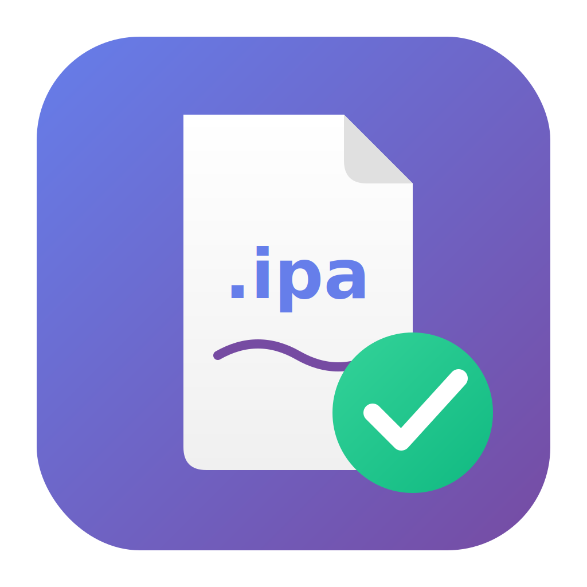

# IPA Signer

<p align="center">
  
</p>

<p align="center">
  <strong>一键签名 iOS 应用的 Mac 工具</strong>
</p>

<p align="center">
  
  
  
</p>

## ✨ 功能特点

- 🔐 **一键签名** - 选择 IPA、证书、描述文件，一键完成签名
- 📱 **设备安装** - 签名完成后直接安装到 iPhone
- 📜 **证书管理** - 支持导入 .cer 和 .p12 证书
- 📖 **详细帮助** - 内置完整的证书申请和签名教程
- 💾 **记住设置** - 自动保存上次的导出目录和证书选择

## 📸 截图

<p align="center">
  
</p>

## 🚀 安装

### 方式一：下载 Release
从 [Releases](https://github.com/leeyifeng/IPASigner/releases) 页面下载最新版本。

### 方式二：源码编译
```bash
git clone https://github.com/leeyifeng/IPASigner.git
cd IPASigner
open IPASigner.xcodeproj
```
在 Xcode 中按 `⌘R` 运行。

## 📋 使用前准备

1. **Apple 开发者账号** - 需要有效的 Apple Developer 账号
2. **开发者证书** - iOS Development 或 Distribution 证书
3. **Provisioning Profile** - 包含目标设备 UDID 的描述文件

## 🔧 使用方法

1. 选择要签名的 IPA 文件
2. 选择 Provisioning Profile (.mobileprovision)
3. 选择签名证书
4. 点击「开始签名」
5. 签名完成后可直接安装到设备

详细教程请点击应用内的「使用帮助」按钮。

## 📲 安装到设备

### 方式一：一键安装
需要先安装 `ideviceinstaller`：
```bash
brew install ideviceinstaller
```

### 方式二：通过 Xcode
1. 打开 Xcode → Window → Devices and Simulators
2. 选择已连接的设备
3. 将签名后的 IPA 拖入已安装应用列表

## ⚙️ 系统要求

- macOS 12.0 或更高版本
- Xcode 14.0 或更高版本（编译需要）

## 🔒 隐私政策

IPA Signer 是完全离线运行的本地应用，不收集任何用户数据。

详见 [隐私政策](privacy-policy/index.html)

## 📄 许可证

本项目采用 MIT 许可证 - 详见 [LICENSE](LICENSE) 文件

## 🤝 贡献

欢迎提交 Issue 和 Pull Request！

## 📧 联系

如有问题，请通过 GitHub Issues 联系。

---

<p align="center">Made with ❤️ for iOS developers</p>
